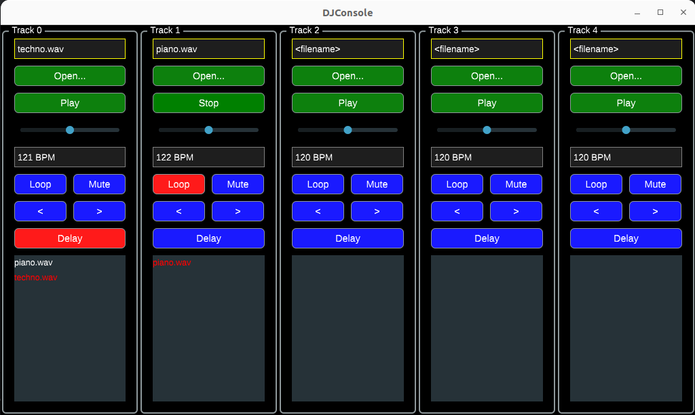

# DjConsole



## Installation

```shell
git submodule update --init
```

### Aubio

On Ubuntu/Debian:
```shell
sudo apt-get install aubio-tools libaubio-dev libaubio-doc doxygen
```

On macOS:
```bash
brew install aubio
````

On Windows:

Download and extract the Aubio DDL from [aubio](https://aubio.org/download)

## Tooling

### ninja

On Ubuntu/Debian:
```bash
sudo apt-get install ninja-build
````
On macOS:
```bash
brew install ninja
````
On Windows:

Download and extract the Ninja executable from the official release page and add it to your PATH.


## Build

### debug
```shell
cmake -G Ninja -DCMAKE_BUILD_TYPE=Debug -S . -B cmake-build-debug
ninja -C cmake-build-debug
```

### release
```shell
cmake -G Ninja -DCMAKE_BUILD_TYPE=Release -S . -B cmake-build-release
ninja -C cmake-build-release
```

### Docs generation
```shell
ninja -C cmake-build-debug doc_doxygen
```

Docs will be placed in `cmake-build-debug/docs`

### Autoformatting
```shell
ninja -C cmake-build-debug run-clang-format
```
### Testing
```shell
ninja -C cmake-build-debug test/test
```

## Opis projektu
Projekt polega na stworzeniu programu z interfejsem graficznym przeznaczonego dla DJ-ów umożliwiającego odtwarzanie utworów i manipulację ich ścieżkami oraz efektami audio w czasie rzeczywistym.

### Wymagania funkcjonalne
- Dodawanie bazy piosenek, z których będzie można tworzyć playlisty i używać ich w programie.
- Możliwość odtwarzania dodanych piosenek lub playlist na trackach (max 5 ścieżek).
- Kontrola odtwarzania piosenek/playlist na ścieżce:
- previous / next
- shuffle (odtwarzanie w losowej kolejności piosenek w playliście)
- loop (odtwarzanie pojedynczej piosenki w pętli)
- jednorazowe odtworzenie
- Odtwarzanie wielu utworów naraz.
- Dostosowywanie głośności i panoramy niezależnie na poszczególnych ścieżkach.
- mute (wyciszenie danej ścieżki)
- solo (puszczenie tylko wybranej ścieżki przy jednoczesnym wyciszeniu pozostałych).
- matchowania tempa utworów - piosenki na syncowanych trackach pozostają w takcie - wykrywanie tempa piosenki, zmiana tempa bez zmiany wysokości utworu
- Efekty audio dla ścieżek: reverb, delay, eq(high,low pass)
- cross fade przy zmianie utworu na ścieżce - płynne przejście pomiędzy ścieżkami
- cue points - po załadowaniu utworów do programu, możliwość dodania timestamp markerów, a następnie po dodaniu piosenki na ścieżkę odtwarzanie od wybranego markera.

## Implementacja
język: CPP
biblioteki:
JUCE(https://juce.com/) - audio, GUI
Boost, STL - pomocnicze
Cmake - budowanie z użyciem dostarczonych funkcji od JUCE
Google test/UnitTestRunner od JUCE - testy jednostkowe
GitHub - CI, git https://github.com/MikolajSzawerda/DJ-Console

### Planowana realizacja
- Kluczowe funkcjonalności(100% realizacji):
- interfejs graficzny umożliwiający manipulację ścieżkami(głośność i panorama, mute, solo) oraz utworzenie banku piosenek
- odtwarzanie wielu utworów równocześnie
- odtwarzanie utworów w playliscie na ścieżce
- cross fade
- multiplatformowość rozwiązania(windows, linux)

### Funkcjonalności pomocnicze(75% realizacji)
- cue points
- efekt audio np eq
- wykrywanie tempa utworu i jego modyfikacja

### Funkcjonalności opcjonalne(przy wystąpieniu rezerwy czasowej)
- matchowanie tempa wskazanych ścieżek i ustawienie ich w takt
- dodatkowe efekty audio reverb, delay
- UI o wysokiej estetyce
